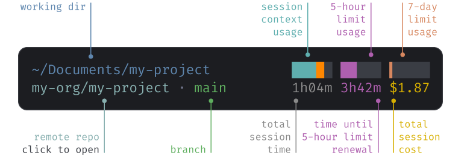

# cc-usage-statusline

A clean status line for [Claude Code](https://claude.com/claude-code) that puts your session at a glance: context window fill, the 5-hour and 7-day rate-limit budgets, session cost and time, and a clickable repo link with the current branch.

<div align="center">
  
</div>

## The context bar tells you when to clear

The color of the session context usage bar tells you when it's worth starting fresh. If you start to see yellow on the context usage bar, run `/compact` to summarize and shrink the context, or `/clear` to start a clean session before response quality starts to slip. If you see red, your context window is about to run out!

## Requirements

- **`jq`** — required (parses the JSON Claude Code feeds the status line).
- **`git`** — optional; without it the repo/branch portion is blank.
- **Claude Code v2.1.153+** recommended: provides an accurate `$COLUMNS` so the right-aligned content doesn't get truncated.

## Install

### Option A: run the installer

From this directory:

```sh
./install.sh
```

It copies `statusline-command.sh` to `~/.claude/`, makes it executable, and merges the `statusLine` setting into `~/.claude/settings.json` (backing up any existing settings to `settings.json.bak`).

### Option B: manual

1. Copy the script and make it executable:
```sh
mkdir -p ~/.claude
cp statusline-command.sh ~/.claude/statusline-command.sh
chmod +x ~/.claude/statusline-command.sh
```
2. Add this to `~/.claude/settings.json`, **merging** it into the existing JSON (don't overwrite the file). Use the absolute path:
```json
{
  "statusLine": {
    "type": "command",
    "command": "/Users/YOU/.claude/statusline-command.sh"
  }
}
```
3. Start a new Claude Code session, or run `/statusline`, to see it.

## Install via your agent

You can tell Claude Code (or another coding agent) to do this for you:

> Install the usage statusline from `https://github.com/Drebin573/cc-usage-statusline`

**Agent instructions** (the steps an agent should follow):
1. Fetch/clone the linked location and locate `statusline-command.sh`.
2. Run `./install.sh` if present. Otherwise do the manual steps:
- `mkdir -p ~/.claude && cp statusline-command.sh ~/.claude/ && chmod +x ~/.claude/statusline-command.sh`
- Merge the `statusLine` key (shown above) into `~/.claude/settings.json` using the **absolute** path to the copied script. **Read the existing file and merge, never overwrite it**, so other settings are preserved.
3. Confirm `jq` is installed; warn the user if not.
4. Tell the user to start a new session or run `/statusline`.

The `statusline-command.sh` file also carries these install steps in its header comment, so the script is self-documenting if read on its own.

## Uninstall

Remove the `statusLine` key from `~/.claude/settings.json` and delete `~/.claude/statusline-command.sh`. If you used `install.sh`, restore `~/.claude/settings.json.bak` if you'd rather roll back wholesale.

## Customization

Open `statusline-command.sh` and edit the `# ── colors ──` block to change colors (values are 256-color ANSI codes), or change `bar_w=5` to make the progress bars wider or narrower. Or ask Claude Code to help you customize it to your heart's content!
